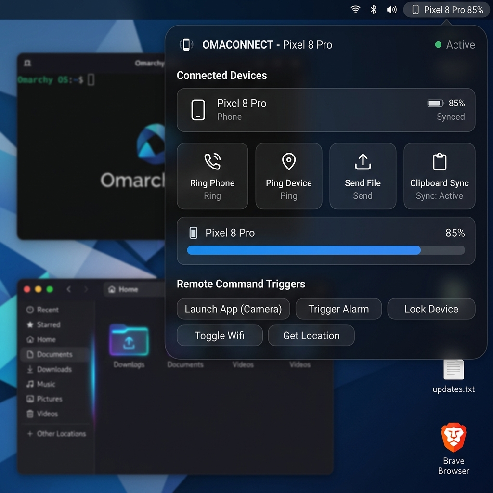

# OmaConnect 📱⚡

> Native KDE Connect integration plugin for the **Omarchy Topbar** & **Quickshell** (Wayland / Hyprland).

OmaConnect seamlessly bridges your Linux desktop with your Android, iOS, or secondary Linux devices using KDE Connect. Built natively with Quickshell and Qt Quick QML, it provides real-time battery monitoring, instant device ringing ("Find My Phone"), clipboard & link sharing, remote command execution, file transfers, and phone notification feeds—all inside a sleek, glassmorphic topbar interface.



---

## ✨ Features

- **📊 Topbar Status Indicator**: Live device connection status, icon indicators, and lowest-battery display directly in your Omarchy panel.
- **📱 Multi-Device Support**: Switch between multiple paired smartphones, tablets, or laptops on the fly with automatic reachability tracking.
- **🔔 Ring & Find My Phone**: One-click audible ringing trigger to locate misplaced devices.
- **💬 Ping & Link Sharing**: Send test pings or broadcast URLs and text directly to your device screen.
- **📂 File Transfer Bridge**: Send files seamlessly from your desktop file manager or popover picker.
- **📋 Wayland Clipboard Sync**: Send copied text to mobile clipboards using native `wl-clipboard` integration.
- **⚡ Remote Device Commands**: Execute remote triggers configured on your mobile phone (e.g., lock device, play/pause media, custom scripts).
- **📬 Phone & SMS Notifications**: View incoming phone notifications and SMS messages in a bounded feed with one-click dismiss and clear-all actions.
- **🎨 Glassmorphic Theme**: Custom dark styling with smooth micro-animations, adaptive HSL color tokens, and full keyboard navigation.

---

## 📦 System Dependencies

OmaConnect relies on lightweight system tools provided by standard Linux package managers:

| Dependency | Purpose | Requirement |
| :--- | :--- | :--- |
| **`quickshell`** | QML desktop shell engine for Omarchy | `>= 0.1.0` (Mandatory) |
| **`kdeconnect`** | Background daemon (`kdeconnectd`) and CLI client (`kdeconnect-cli`) | Mandatory |
| **`wl-clipboard`** | Wayland clipboard integration (`wl-paste`) | Recommended |
| **`kdialog` / `zenity`** | Native file selection dialog for file transfers | Optional (Fallback provided) |

### Installing Dependencies

#### Arch Linux / Omarchy OS:
```bash
sudo pacman -S kdeconnect wl-clipboard kdialog
```

#### Ubuntu / Debian:
```bash
sudo apt update && sudo apt install kdeconnect wl-clipboard kdialog
```

#### Fedora:
```bash
sudo dnf install kdeconnect wl-clipboard kdialog
```

---

## 🚀 Installation

### Option A: Omarchy Marketplace (Recommended)
Once available on the Omarchy Plugin Marketplace, install directly with:
```bash
omarchy-plugin install omaconnect
```

### Option B: Manual Installation (Git Clone)
To install OmaConnect manually into your local Omarchy configuration:

```bash
# Create plugins directory if it doesn't exist
mkdir -p ~/.config/omarchy/plugins

# Clone OmaConnect into plugins folder
git clone https://github.com/user/omaconnect.git ~/.config/omarchy/plugins/omaconnect

# Restart Quickshell or reload Omarchy topbar
omarchy-shell reload
```

---

## 💻 Usage & Keyboard Controls

### Launch & Test Mode
Run OmaConnect directly using Quickshell's runner:
```bash
qs -p main.qml
```

### Quick Interactions
- **Click Topbar Button**: Toggle the OmaConnect Popover Menu.
- **Device Picker**: Select your target active device from the dropdown header.
- **Ring Phone**: Triggers full-volume sound on the selected phone until dismissed on-device.
- **Ping Device**: Sends a toast message to the mobile device.
- **Send Clipboard**: Sends your current desktop Wayland selection to the phone clipboard.
- **Send File**: Opens file selection dialog and transmits file over Wi-Fi.
- **Remote Commands**: Click any exposed command pill to trigger remote desktop/phone actions.
- **Notifications**: Hover or scroll through incoming notifications; click `✕` to dismiss individual items or `Clear All` to purge.

### Keyboard Navigation & Accessibility
- **`Tab` / `Shift+Tab`**: Cycle focus across topbar button, device cards, action buttons, and notification controls.
- **`Enter` / `Space`**: Activate focused controls and buttons.
- **`Escape`**: Immediately close the popover window.

---

## 🛠️ Troubleshooting

### 1. "KDE Connect Daemon Unreachable"
- **Cause**: The `kdeconnectd` background daemon is not running.
- **Fix**: Start the daemon manually or enable its systemd user service:
  ```bash
  systemctl --user enable --now kdeconnect
  ```

### 2. Device Appears "Offline" or "Unreachable"
- **Cause**: Phone and desktop are on different Wi-Fi networks, or local firewall (UFW/firewalld) is blocking ports.
- **Fix**:
  - Ensure both devices are connected to the same local network.
  - Open UDP and TCP ports `1714-1764`:
    ```bash
    sudo ufw allow 1714:1764/udp
    sudo ufw allow 1714:1764/tcp
    sudo ufw reload
    ```

### 3. Clipboard Sharing Not Working
- **Cause**: `wl-clipboard` utility missing or system is not running Wayland.
- **Fix**: Install `wl-clipboard` (`sudo pacman -S wl-clipboard`).

### 4. File Transfer Dialog Fails
- **Cause**: Neither `kdialog` nor `zenity` is installed on your system.
- **Fix**: Install `kdialog` or `zenity` via your package manager.

---

## 🔒 Privacy & Security Guarantees

OmaConnect is engineered with a **Privacy-First** architecture:

1. **100% Local IPC Communication**: All data exchanges occur strictly between `quickshell`, `kdeconnect-cli`, and your local D-Bus session (`org.kde.kdeconnect`).
2. **Zero External Network Calls**: OmaConnect makes zero telemetry requests, zero analytics calls, and zero internet connections.
3. **Topbar Privacy Boundary**: High-sensitivity notification body text and SMS content are **never** rendered on the open topbar. Only aggregate device counts and lowest battery levels are displayed in the status bar.
4. **Isolated Process Execution**: System commands are executed via parameterized arguments (`Quickshell.Io.Process`), preventing shell injection vulnerabilities.

---

## 🗑️ Uninstallation

### Via Marketplace:
```bash
omarchy-plugin remove omaconnect
```

### Manual Removal:
```bash
rm -rf ~/.config/omarchy/plugins/omaconnect
omarchy-shell reload
```

---

## 📋 Marketplace Publishing Release Checklist

Before submitting a new release candidate of OmaConnect to `omarchyplugins.com`:

1. **Verify Manifest Schema (`plugin.json`)**:
   - Ensure `id`, `version`, `category`, `license`, `entry`, `dependencies`, and `minOmarchyVersion` are correct.
2. **Validate Assets**:
   - Confirm `assets/icon.svg` is present and formatted.
   - Confirm `assets/screenshot.png` is updated with a representative UI preview.
3. **Execute Local Validation Suite**:
   ```bash
   bash scripts/validate.sh
   ```
   *Must report `✔ All validation checks passed cleanly!` with 0 errors.*
4. **Git Tagging**:
   ```bash
   git add .
   git commit -m "release: OmaConnect v1.0.0"
   git tag -a v1.0.0 -m "OmaConnect Version 1.0.0 Release Candidate"
   git push origin main --tags
   ```
5. **Submit to Marketplace**:
   - Submit issue request at `https://github.com/HANCORE-linux/omarchy-plugin-marketplace/issues/new?template=submit-plugin.yml`.

---

## 📜 License

OmaConnect is licensed under the [MIT License](LICENSE).
