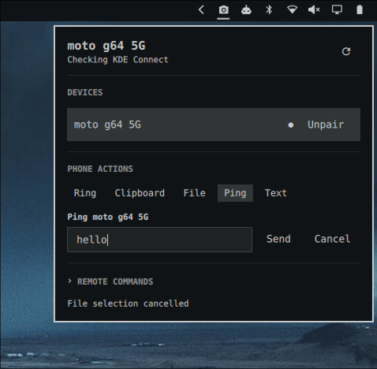

# OmaConnect

OmaConnect integrates KDE Connect device status, battery monitoring, and remote actions into the Omarchy bar.



## Install

```bash
omarchy plugin add https://github.com/jitendradara12/omaconnect.git --enable --yes
```

## Features

- **Device Monitoring**: Real-time battery percentage, charging state, reachability, and pairing status.
- **Quick Actions**: Ring device, sync clipboard, send files via native file picker, send ping messages, and share text or links.
- **Remote Commands**: Execute custom commands configured on target devices.
- **Pairing Management**: Inline pair and unpair requests with two-step confirmation.
- **Keyboard Navigation**: Full vim-style navigation (`h`/`j`/`k`/`l`), keybindings, and shortcuts.

## Shortcuts

Add to `~/.config/omarchy/shortcuts.lua`:

```lua
o.bind("SUPER + Shift + C", "Toggle OmaConnect", "omarchy-shell shell toggle omaconnect")
```

### Panel Bindings

| Key | Action |
| :--- | :--- |
| `h`, `l` / `Left`, `Right` | Switch focus between Devices, Actions, and Remote Commands |
| `j`, `k` / `Down`, `Up` | Navigate items within active section |
| `Enter`, `Space` | Activate focused item or submit active composer |
| `p` | Pair selected device |
| `u` | Request unpair confirmation for selected device |
| `y` / `c` (`Esc`) | Confirm (`y`) or cancel (`c`/`Esc`) unpair prompt |
| `r` | Refresh device status |
| `Esc` | Close active composer or hide panel |

## Dependencies

Requires `kdeconnect`, `glib2`, and `dbus`:

```bash
sudo pacman -S kdeconnect glib2 dbus
```

## Update

```bash
omarchy plugin update omaconnect
```

## Uninstall

```bash
omarchy plugin remove omaconnect
```

